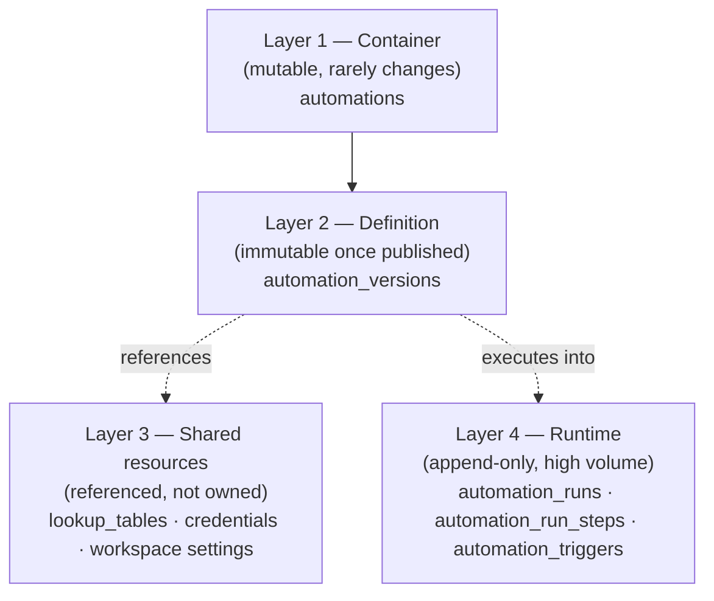
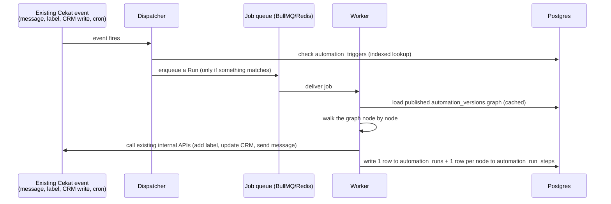

# Cekat Automations — Data, Services & Schema

## The one-paragraph version, if you only have 30 seconds

Think of it as three pieces. A **filing cabinet** holds every automation someone has built, with full version history (like Google Docs version history). A **mailroom** watches everything happening in Cekat (a message arrives, a label gets added, a CRM field changes) and decides which automations should react. A **logbook** records every single time an automation actually ran, so anyone can look up "did this run for this customer, and what happened." None of this is a new backend from scratch — it's ~7 new database tables sitting on top of infrastructure Cekat already runs in production today.

---

## 1. The services — what actually runs

| Service | What it does | New or reused? |
| --- | --- | --- |
| **Dispatcher** | Watches Cekat's existing events (message received, label changed, CRM write, cron tick, inbound webhook) and checks whether any published automation is subscribed. Decides *before* anything expensive happens. | New — but small; it's a lookup, not a workflow engine. |
| **Worker** | Picks up a matched job, loads the automation's published version, walks through it node by node, and calls Cekat's own internal APIs to actually do things (add a label, update a CRM row, send a message). | New. |
| **API** | The "front door" — everything the visual canvas does (create, edit, publish, test-run, list runs) goes through this. Built API-first, so the engine works even before the drag-and-drop builder is finished. | New. |
| **Job queue (BullMQ + Redis)** | Holds the queue of "runs waiting to execute." | **Reused** — same queue technology the Marketing module already runs on. |
| **Database (Supabase/Postgres)** | Where every table below lives. | **Reused** — same database Cekat already runs. |
| **Object storage** | Holds the actual message/CRM payload contents from each run step (see §4 — kept out of Postgres on purpose). | **Reused** — same pattern as any S3-style bucket Cekat already uses for large files. |

**The talking point:** we are not building a new backend. We're adding a dispatcher, a worker, and roughly seven tables on top of infrastructure already running in production. That's a deliberate risk-reduction choice, not a shortcut.

---

## 2. The four data layers

The PRD splits an automation into four layers by how often each one changes and who owns it. This is the single most useful mental model if the CEO asks "how is this actually stored" — each layer below maps to specific tables.

### Layer 1 — Container: `automations`

The named thing a user sees in the workflow list. One row per automation.

| Column | What it holds |
| --- | --- |
| `id` | Unique ID |
| `business_id` | Which client this belongs to (see §5 — this is how multi-tenancy works) |
| `name`, `tags` | What the user sees in the list |
| `enabled` | The on/off switch — independent of publish state (see the on/off vs. publish explainer we covered earlier) |
| `created_by`, `last_edited_by` | Attribution — this alone fixes n8n's "every admin shares one login" problem |
| `created_at`, `updated_at` | Standard timestamps |

### Layer 2 — Definition: `automation_versions`

Every time someone hits Publish, a new row is written here. Rows are never edited or deleted — only added. This is what makes "restore any old version" trivially safe: restoring just points `published` at an older row instead of destroying anything.

| Column | What it holds |
| --- | --- |
| `id` | Unique ID |
| `automation_id` | Which automation this version belongs to |
| `version_number` | 1, 2, 3… |
| `graph` | **One JSON document** containing the entire canvas — every node, every connection, every field the user configured |
| `status` | `draft` or `published` — at most one draft and one published version exist at a time |
| `published_by`, `published_at`, `change_note` | Who published it, when, and an optional note |

**Why the whole canvas is one JSON blob, not one database row per node:** the canvas only changes when a human edits it (rare, cheap), and it needs to be versioned as a single unit — a version either is or isn't the one that's live. Storing it as one document per version is simpler and is literally what makes version history and restore work as a single, safe operation instead of a complex multi-table transaction.

### Layer 3 — Shared resources

Things nodes point at, but that live *outside* the version and change on their own schedule. Deliberately **not** included in the version snapshot.

| Table | What it holds |
| --- | --- |
| `lookup_tables` (+ rows) | Business-owned key→value maps a node can reference (e.g. "which board does each inbox map to") |
| `credentials` | Encrypted secrets for the HTTP node — referenced by ID only, never shown in the UI or written into run logs |
| Workspace settings | Business-level defaults (timezone, date format) — likely a few columns on Cekat's existing business-settings table, not a new one |
| Reference data (inboxes, boards, labels, agents…) | **Not new tables at all** — these already exist elsewhere in Cekat. Automations just stores their IDs and validates against the real thing at save and publish time. This is the direct fix for the "typo'd board ID" and "stray character in a label name" bugs found in the n8n audit. |

⚠️ One consequence worth flagging pre-emptively: restoring an old version does **not** restore a lookup table or credential to how it looked back then — those are live, shared resources. The UI has to say so plainly.

### Layer 4 — Runtime (the high-volume part)

Everything that happens when an automation actually fires. This layer is append-only and is where n8n's best-documented production failure lives (its execution table growing to 40+ GB), so it's designed against that from day one.

| Table | What it holds | Retention |
| --- | --- | --- |
| `automation_triggers` | One row per (business, event type, scope) written when a version is published. This is the index the Dispatcher checks — "does anything care about this event, for this business." | Lives as long as the automation is published |
| `automation_runs` | One row per execution: which automation, which version, status, timing, the event that caused it | 90 days at full detail, then rolled up |
| `automation_run_steps` | One row per node *per run* (loop iterations aggregate into one row, not one per item): status, duration, error, and a *pointer* to the actual payload — not the payload itself | 30 days |
| Object storage (payload bodies) | The actual input/output data for each step | 7 days for successful runs, 30 days for failed ones |
| `automation_run_rollups` | Pre-computed daily counters (runs/day, error rate per automation) — survives after the detailed rows above age out | Indefinite |

**Why the payload data lives outside Postgres:** large JSON blobs stored inline are exactly what caused n8n's documented Postgres bloat problem. Pointing at object storage keeps the database itself small and fast, while the data is still there when someone needs to debug a specific failure.

**Why successful runs keep their payloads for only 7 days while failures keep theirs for 30:** you rarely need to inspect a run that worked; you very often need to inspect one that didn't. This is the same logic n8n's own community recommends as a manual fix — we're just defaulting to it instead of making every client discover it after an incident.

---

## 3. The event flow, end to end

The important detail here for a non-technical explanation: **the Dispatcher checks *before* anything expensive happens.** This is the direct fix for why n8n costs so much to run — today, every message on a watched inbox creates a full execution that a filter node then throws away. Here, an inbox nobody's automations care about never creates a run at all.

Also non-negotiable per the PRD: this dispatch is "fire-and-forget" — if an automation fails, it must never delay or block a real customer's message from going out. That's the same rule the existing Marketing module already follows.

---

## 4. How multi-tenancy works (the "why don't we need one database per client" question)

Every single table above carries a `business_id` column, and every query is filtered by it. That's the entire mechanism — no separate database or schema per client, unlike n8n's current self-hosted setup (which provisions a new n8n user per business and writes directly into n8n's internal schema, something the PRD flags as a real operational risk today).

The upside of the shared-table approach: one thing to monitor and upgrade instead of one per client, and it's what makes cross-workflow features like "search all your executions" and future admin tooling possible at all.

---

## 5. What's genuinely new vs. what we're reusing

This is the framing to use if the CEO's real question is "how much are we building."

**New tables (~7):** `automations`, `automation_versions`, `automation_triggers`, `automation_runs`, `automation_run_steps`, `automation_run_rollups`, `lookup_tables` (+ rows). Possibly an 8th if credentials need their own store rather than reusing an existing Cekat secrets mechanism (open question — see §6).

**Reused, unchanged:** the job queue (BullMQ/Redis), the database itself (Supabase/Postgres), object storage, every internal Cekat API the nodes call into (label, CRM, conversation, notification routes — already live in production), and — pending confirmation — the platform's existing audit-log mechanism, since "log every change" is already a cross-product requirement, not something unique to Automations.

---

## 6. Open items — so you're not caught off guard if asked

Flagging these honestly is better than presenting the schema as fully locked. All are called out in the full PRD, not new gaps introduced here.

- **Retention windows** (90 days / 30 days / 7 days above) are recommendations, not yet signed off by engineering.
- **Credentials storage** — whether this is a new encrypted table or reuses an existing Cekat secrets store isn't confirmed yet.
- **Per-business rate limits** (max concurrent runs, max runs/minute, max steps per run) are real requirements with no numbers attached yet — TBD with engineering.
- **The CRM "field changed" trigger** needs a way to detect when a CRM record's field changes — either an existing hook already exists, or a new small table has to be added to catch these changes as they happen. This is called out in the PRD as the single biggest unknown in the whole trigger set, and it's a week-1 spike specifically to resolve it before broader work starts.
- **A workflow census across every client** runs in week 1, before this scope is locked further — this schema is sized for what two audited clients' workflows need, not yet confirmed against the full client base.

---

## 7. If asked "why not just copy n8n's schema"

Short answer: n8n's schema is designed for a tool that doesn't know anything about Cekat's data. Ours is designed around the specific bugs that showed up in real audited workflows — typo'd board IDs, unwired branches that silently drop customers, hardcoded tokens in plaintext, a table that grows without bound. Every table and retention rule above traces back to one of those specific, already-documented problems, not a generic "let's build a workflow engine" exercise.
